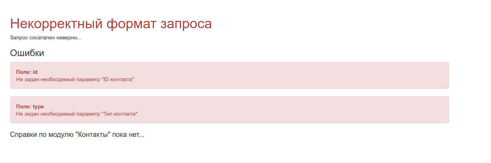

# Введение
#### Описание

Сервис предназначен для любых межсервисных (между ЛК и Planfix) операций, таких как:
- Переход от контакта из Planfix в ЛК и обратно
- Создание и переход к задачам Planfix
- И пр.

#### Routes

Сервис работает в режиме like-API, и способен принимать GET и POST запросы, а также отвечать, как веб-сервис или API.

Запросы структурированы следующим образом:
```
{protocol}{service_host}/{mode}/{controller}/{action}/{handler}/{target}?{$args}
```
где:

| Атрибут           | Описание          | Возможные значения                        |
| -------------     |:-----------------:|------------------------------------------ |
| **protocol**      |Протокол           |   ``http``                                |
| **service_host**  |Хост сервиса       |   ``planfix.leads.local``                 |
| **modules**       |Режим / Модуль     |  ``service`` ``api``                      |
| **controller**    |Контроллер         |   ``link``                                |
| **action**        |Действие           |   ``contact`` ``tracking-domain-task``    |
| **handler**       |Обработчик         |   ``goto`` ``url``                        |
| **target**        |Цель               |   ``planfix`` ``cabinet``                 |
| **$args**         |Параметры          |   *                                       |


**$args** - могут быть переданы GET / POST запросом.
Состав определяется моделью, соответсвующей **action**.


**Примеры:**

---
###### Запрос API
```
http://planfix.romanb.leads/api/link/tracking-domain-task/open/planfix?platform=leads&offerId=476&domain=trk.alexeyf.leads
```
###### Ответ 

```json
{
    "status": "success",
    "data": "http://leads-test.planfix.ru/task/30823"
}
```
---
###### Запрос Service
```
http://planfix.romanb.leads/service/link/tracking-domain-task/open/planfix?platform=leads&offerId=476&domain=trk.alexeyf.leads
```
###### Ответ 
```yaml
redirect: "http://leads-test.planfix.ru/task/30823"
```
---

#### Errors

###### Ошибка Service


###### Ошибка API
```json
{
  "status": "error",
  "errors": [
    {
        "header": "404",
        "message": "Контакт не существует",
        "fields": [],
        "code": 0
    }
  ]
}
```

# Контакты
---
#### GoTo / Url
##### Planfix - Cabinet
| Атрибут           | Правило                                   |
| -------------     |------------------------------------------ |
| **controller**    |   ``link``                                |
| **action**        |   ``contact``                             |
| **handler**       |   ``goto``  / ``url``                     |
| **target**        |   ``cabinet``                             |
| **$args**         |   *                                       |
| id                |   ``(integer){planfix_id}``               |
| type              |   ``user`` / ``contact``                  |
| platform          |   ``leads`` / ``trade``                   |

> http://planfix.romanb.leads/api/link/contact/goto/cabinet?platform=leads&id=391608&type=user

##### Cabinet - Planfix
| Атрибут           | Правило                                   |
| -------------     |------------------------------------------ |
| **controller**    |   ``link``                                |
| **action**        |   ``contact``                             |
| **handler**       |   ``goto``  / ``url``                     |
| **target**        |   ``planfix``                             |
| **$args**         |   *                                       |
| id                |   ``(integer){cabinet.*.id}``             |
| type              |   ``affiliate`` / ``advertiser``          |
| platform          |   ``leads`` / ``trade``                   |

> http://planfix.romanb.leads/service/link/contact/goto/planfix?platform=leads&id=13&type=advertiser


# Задачи по подключению трекингового домена

#### Open
##### Planfix - Cabinet

> НЕДОСТУПНО

##### Cabinet - Planfix

Если задача отстутсвует - сервис создаст ее.
Если проект == оффер отсутсвует - сервис создаст сначала его.

| Атрибут           | Правило                                           |
| -------------     |------------------------------------------         |
| **controller**    |   ``link``                                        |
| **action**        |   ``tracking-domain-task``                        |
| **handler**       |   ``open``                                        |
| **target**        |   ``planfix``                                     |
| **$args**         |   *                                               |
| offerId           |   ``(integer){cabinet.offer.id}``                 |
| domain            |   ``(string){cabinet.tracking_domains.domain}``   |
| platform          |   ``leads`` / ``trade``                           |

> http://planfix.romanb.leads/api/link/tracking-domain-task/open/planfix?platform=leads&offerId=476&domain=trk.alexeyf.leads

---

#### changeStatus

Изменяет статус связки Offer-to-TrackingDomain

##### Planfix - Cabinet


| Атрибут           | Правило                                           |
| -------------     |------------------------------------------         |
| **controller**    |   ``link``                                        |
| **action**        |   ``tracking-domain-task``                        |
| **handler**       |   ``changeStatus``                                |
| **target**        |   ``cabinet``                                     |
| **$args**         |   *                                               |
| taskId            |   ``(integer){planfix_id}``                       |
| status            |   ``(string)В тестировании, Новая и т.д``         |

> http://planfix.romanb.leads/api/link/tracking-domain-task/changeStatus/cabinet

```json
{
    "taskId" : 13487618,
    "status" : "Новая"
}
```

##### Cabinet - Planfix
> НЕДОСТУПНО


---

#### changeComment

Изменяет комментарий к связке Offer-to-TrackingDomain

##### Planfix - Cabinet


| Атрибут           | Правило                                           |
| -------------     |------------------------------------------         |
| **controller**    |   ``link``                                        |
| **action**        |   ``tracking-domain-task``                        |
| **handler**       |   ``changeStatus``                                |
| **target**        |   ``cabinet``                                     |
| **$args**         |   *                                               |
| taskId            |   ``(integer){planfix_id}``                       |
| comment           |   ``(string)Текст комментария, .... ``            |

> http://planfix.romanb.leads/api/link/tracking-domain-task/changeComment/cabinet

```json
{
    "taskId" : 13487618,
    "comment" : "Новая"
}
```

##### Cabinet - Planfix
> НЕДОСТУПНО